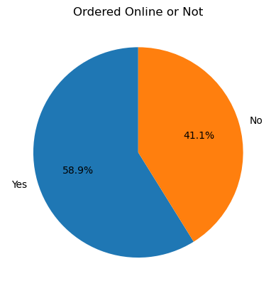
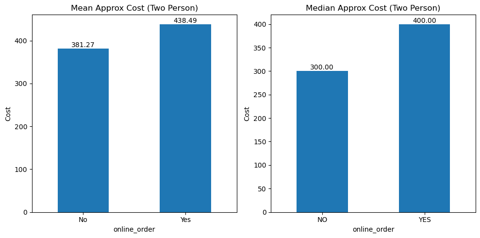
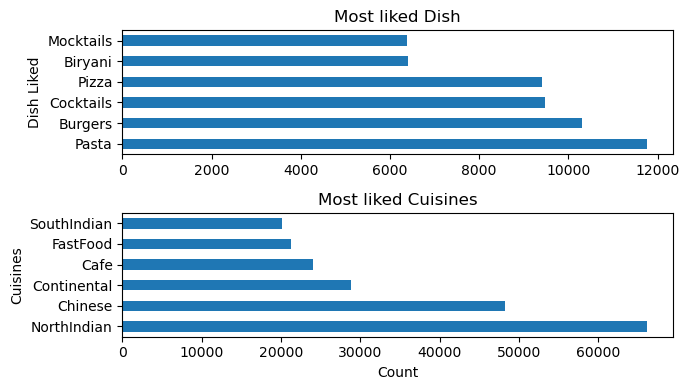
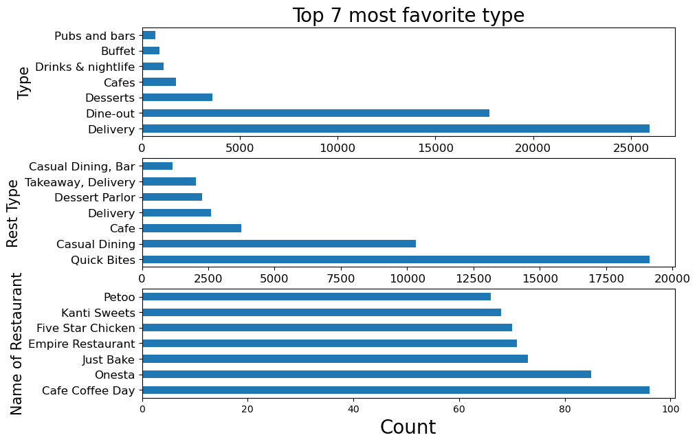
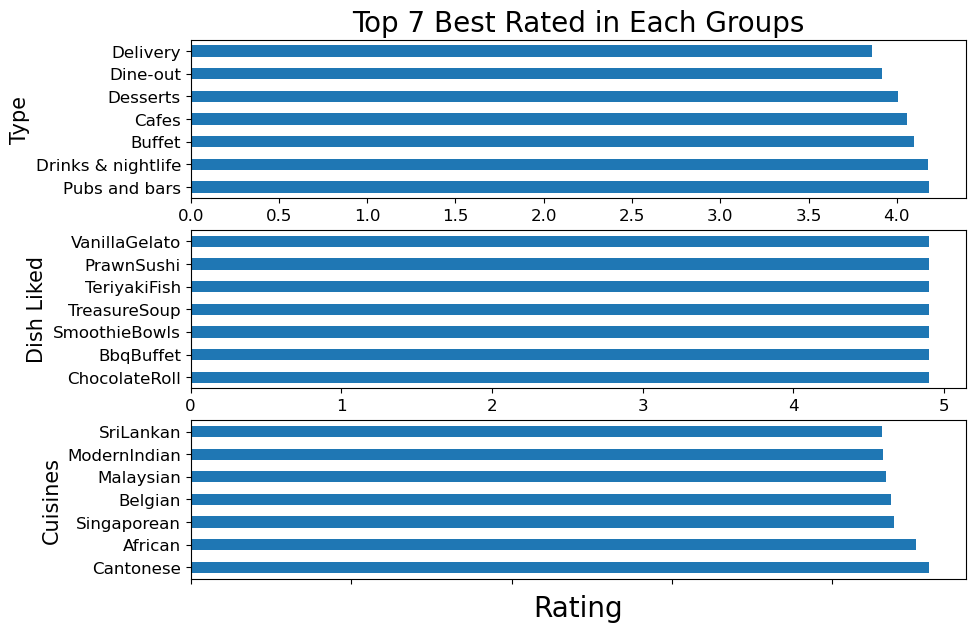
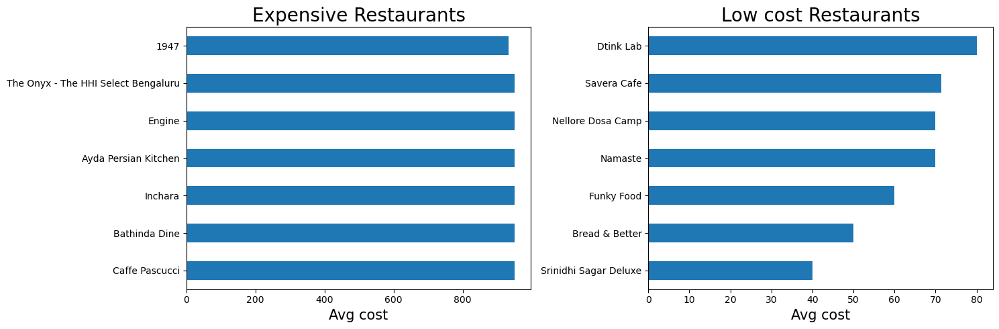
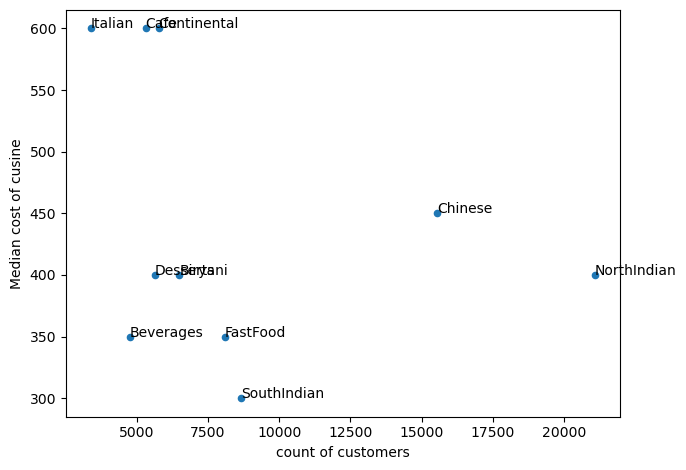

# Overview
Welcome to my analysis of  zomato data. This project is created in a dedire to navigate the online food delivery industry where we focus on the type of foods, cuisines, resturents and food type  . Here we dive in to the the the cost,rating and numberof customers of each type of foods, cuisines, resturents and food type.
The data is taken from kaggle an online public platform where data is available and free to use.Through  Python queries I have analysed the Data and found some intresting insights.

# The Questions
Below are the Questions I want to answer through this analysis:
   
    1. What is the percent of ordered  online and the cost difference of online and offline orders?
    2. which are the top 7 most favrite among differnt groups based on customer?
    3. which are the top 7 most favrite among differnt groups based on rating
    4. which are the least and most expensive type in each group
    5. which are the least and most expensive Resturants
    6. what is the relationship between cost and number of customer for cuisines 

# Tools I have used
 To deep dive into the project I have harnessed many tools:
 1. Python:The backbone of my analysis, help me to analyze the data and critical insights 
    - Pandas Library:
    - metplotlib library
    - Seaborn library
 2. jupyter notebook
 3. visual studio code
 4. Git and GitHup

# Data preparation and CleanUp
 This section outline the steps taken to prepare the data for analysis,ensuring accuracy and usablity.
 ## Import 
  I start by Importing necessary libraries and loading the dataset for analysis.
```python
# importing libraries
import pandas as pd
import dataset as ds
import matplotlib.pyplot as plt
import seaborn as sns
# Loading the data set
df = pd.read_csv('D:/Desktop/data/zomato.csv')
```
## Clean up the data
 After looking for duplicate and Null/NaN values I have format the phone Number column which was a really mess.
 ```python
 #fill na and replace Nan values with empty strings.
 df =df.replace('nan','')
df = df.replace('[]','')
df= df.replace('NaN','',)
df = df.fillna('')
 #clear the messy format into single one
 df['phone']=df['phone'].str.replace('[^a-zA-Z0-9]','')
df['phone']= df['phone'].apply(lambda x:str(x))
# Correcting the code number and format the number

df['phone']=df['phone'].replace('^\+91 ','0',regex= True)
df['phone'] = df['phone'].apply(lambda x:x[0:3]+'-'+x[3:7]+'-'+x[7:11])
```
## Changing the data type
 Two columns are numeric but listed as Object I Have changed the data type:
 ```python
 # changing the data type of 'approx_cost(for two people)' and rename the column to 'apprx_cost(two person)'
 df['approx_cost(for two people)'] = pd.to_numeric(df['approx_cost(for two people)'] ,errors='coerce').astype('Int64')
type(df['approx_cost(for two people)'])
df.rename({'approx_cost(for two people)':'apprx_cost(two person)'},axis=1,inplace=True)

 # changing the data type of 'rate' and rename the column to 'rate_outof_5'
 df['rate']=df['rate'].str.strip('\/5') # remove the"/5" to for usability
df['rate']  = pd.to_numeric(df['rate']  ,errors='coerce').astype('float')
df.rename({'rate':'rate_outof_5'},axis=1,inplace=True)
```
## Changing the data type into list
 Two columns are not in proper data type I have changed into List for future usability
 ```python
 #Changing the column "dish_liked" into list
 df['dish_liked']=df['dish_liked'].str.replace(" ","",regex= False)
df['dish_liked'].apply(lambda x: x != '')
df['dish_liked']=df['dish_liked'].str.split(',')

#Changing the column "dish_liked" into list
df['cuisines']=df['cuisines'].str.replace(" ","",regex= False)
df['cuisines']=df['cuisines'].str.split(',')
# dropped the a column which can't be used
df.menu_item
df = df.drop(columns='menu_item')
```
# The analysis
 In this part I will try to answer the Questions that I have put forward in start of the project.

## 1. What is the percent and cost difference of online and offline orders
 To analyze the status of online vs offline orders I made a simple pie chart and Bar chart to compare the median and mean cost of online vs offline.
 
 ### Results
 

 ### Insights
  These are the key take aways from the analysis:
   - Most of the products are delivered online about 59%.
   - About 41% are not deliverd 

### 2_cost difference

### Insights
  - There is huge difference in mean and median cost of food on delivery basis.
  - online food cost more in both mean and median averages.
  - Median cost is way less than mean values so there will some outliers in the data.

## 2. Which are the top 7 most favourite among differnt groups based on customer?
Here we will see with the help of bar plots which are the most favorite dish, cuisines, resturents and others types:
 
### Results


### Insights
 - Fast foods occupies top 3 out of 4 on  basis of orders, pasta with nearly 12000 customers,burger(10000).
 - Biryani(6500) occupoes fifth position and no other main dish can get into top 7.
  - North indian cuisine(7000) occupy the first place followed by Chinese and Continental(5000).
  - Delivery(27000) is most favorite type of followed by Dine out(17000) other are no where near.
  - Rest type's most liked are QuickBites(19000) and Dine Out(10000).
  - Most favorite Resturent is Cafe Cofee Day followed by Onesta and just bake.

## 3. which are the top 7 most favrite among differnt groups based on rating
 ### Results
 

### Insights
- Pubs and Bars are most rated(4.3) type followed by Drink&nightlife(4.3), Buffet(4.2), Cafes(4.1).
- Top 7 Dishes are rated equally so no campirison between top 7.
- Most of the top 7 Dishes are chocholate, drinks or something Light.
- Mosr rated Cuisines are Cantonese and African followed by Sangaporean, Belgian, and Maleysian.

## 4. which are the least and most expensive Resturants

### Results
 

### Insights
- Caffe Pascucci,Bathinda Dine,           Inchara, Ayda Persian Kitchen,Engine,The Onyx - The HHI Select Bengaluru are the most Expensive resturents that cost exactly 950 each for two person.
- Most Economical resturents are Srinidhi Sagar Deluxe (cost = 40.0), then Bread & Better (cost =  50.0),Funky Food (cost =  60.0), Namaste (cost = 70.0),Nellore Dosa Camp(cost = 70.0) and Savera Cafe (cost = 71.428571)

##  5. what is the relationship between cost and number of customer for cuisines 

### Results

 ### Insights
 - From the plot it is clear that  high prices and low prices does not attract customers.
 - Italian and Continental have highest cost but low customers also south indians dishes have low cost but less customers.
 - North indian and Chinese foods lays somewhere in middle level of cost but they have a huge customers.

 # More Insights

 I have found more intresting insights from this analysis , to see more details just look at my [Jupyter_Note_Book](2_cleaning_and_analyzing_data.ipynb)

 ### THANK YOU FOR YOUR TIME!
  